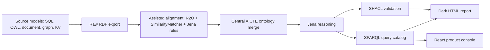

# SEMLINK

**SEMLINK** is a Java 21 semantic integration framework for the AICTE accreditation use case. It demonstrates how heterogeneous university data models can be aligned under one OWL ontology, validated with SHACL, reasoned over with Apache Jena, and queried through a single SPARQL interface.

The project began as a Data Modelling course deliverable and now has a framework-style v2 baseline: adapter interfaces, schema descriptors, schema drift detection, natural-language query translation, a React + Vite product console, a dark HTML report fallback, and workflow resources for additional domains.

> Pitch line: **SEMLINK is the semantic bridge that makes every database speak the same language.**

## What SEMLINK Demonstrates

SEMLINK explicitly covers these data modelling concepts:

- **ER and EER modelling:** Student, Faculty, Course, Department, College, University, Enrollment, generalisation, weak entity modelling, and aggregation.
- **Relational model:** normalized university schema, keys, foreign keys, 3NF/BCNF reasoning, SQL DDL parsing, and R2RML-style mapping.
- **OWL/RDF ontology model:** AICTE ontology, local university ontologies, classes, object properties, data properties, individuals, equivalent classes, equivalent properties, and `owl:sameAs`.
- **Graph model:** RDF graph and property-graph-style university mappings.
- **Document model:** Mongo-style schema representation and JSON-to-RDF mapping hooks.
- **Key-value and wide-column model:** Redis/Cassandra style parser hooks and RDF export scaffolding.
- **Semantic mapping:** R2O raw export, assisted refinement, Jena rules, and similarity-based mapping suggestions.
- **Data quality:** SHACL validation for central AICTE-aligned data.
- **Federated query model:** SPARQL query layer and framework hooks for SERVICE-style federation.
- **Versioning and schema evolution:** ontology/schema diffing and `versions.json` output.

## Current AICTE Domain

The runnable domain is **Higher Education / AICTE accreditation**.

Four universities use different local vocabularies and modelling styles. SEMLINK maps them into the central AICTE vocabulary so one query can return unified results.

| University | Modelling style | Example local terms | AICTE alignment |
| --- | --- | --- | --- |
| University1 | Relational-style ontology and R2O sample | `Student`, `College`, `Course`, `Department` | Direct AICTE equivalents |
| University2 | Document-style vocabulary | `Learner`, `Institute`, `Module`, `School` | Equivalent class/property mappings |
| University3 | Graph-style vocabulary | `Pupil`, `CampusCollege`, `Subject`, `FacultyArea` | Graph-like entity relationships |
| University4 | KV/indirect relationship vocabulary | `StudentInfo`, `AffiliatedCollege`, `Paper`, `Division` | Rule-based structural inference |

## Tech Stack

| Layer | Technology |
| --- | --- |
| Language | Java 21 |
| Build | Apache Maven 3.x |
| RDF/OWL/SPARQL | Apache Jena 6.0.0 |
| OWL API support | `jena-ontapi` 6.0.0 |
| Validation | Apache Jena SHACL |
| Reasoning | Jena rule reasoner |
| Tests | JUnit 3-compatible tests |
| Product UI | React 19 + Vite console in `semlink-ui/` |
| Report UI | Static dark HTML generated into `target/semantic-output/index.html` |

If your shell defaults to an older Java version, prefix commands with:

```bash
JAVA_HOME=$(/usr/libexec/java_home -v 25)
```

## Quick Start

Compile and test:

```bash
JAVA_HOME=$(/usr/libexec/java_home -v 25) mvn -q test
```

Run the full AICTE semantic pipeline:

```bash
JAVA_HOME=$(/usr/libexec/java_home -v 25) mvn -q exec:java -Dexec.args="demo"
```

Generate the dark presentation UI:

```bash
JAVA_HOME=$(/usr/libexec/java_home -v 25) mvn -q exec:java -Dexec.args="report"
```

Open:

```text
target/semantic-output/index.html
```

Run the product console:

```bash
cd semlink-ui
npm install
npm run dev -- --port 5173
```

Open:

```text
http://127.0.0.1:5173
```

Run the full presentation pipeline in one command:

```bash
JAVA_HOME=$(/usr/libexec/java_home -v 25) mvn -q exec:java -Dexec.args="pipeline run"
```

## AI-Powered "Zero-Touch" Onboarding

SEMLINK now supports fully automated university onboarding using Google Gemini. You only need to provide a `.sql` schema, and the AI handles the rest.

### The 4 Golden Steps:

1. **Automate**: AI authors the R2RML mapping file from your SQL.
   ```bash
   export $(cat .env | xargs) && JAVA_HOME=$(/usr/libexec/java_home -v 25) mvn exec:java -Dexec.args="r2o automate <university_name>"
   ```
2. **Generate**: Transform SQL data into semantic SPO triples.
   ```bash
   JAVA_HOME=$(/usr/libexec/java_home -v 25) mvn exec:java -Dexec.args="r2o generate <university_name> file mappings/<university_name>/r2rml-mapping.ttl"
   ```
3. **Query**: Run standard SPARQL checks on the new integrated data.
   ```bash
   JAVA_HOME=$(/usr/libexec/java_home -v 25) mvn exec:java -Dexec.args="query cs_students_by_university"
   ```
4. **Natural Language**: Ask questions in plain English across the new graph.
   ```bash
   export $(cat .env | xargs) && JAVA_HOME=$(/usr/libexec/java_home -v 25) mvn exec:java -Dexec.args="nl Show all students from <university_name> in CSE"
   ```

> **Note:** Ensure your `GEMINI_API_KEY` is set in the `.env` file for steps 1 and 4.

## Main CLI Commands

| Command | Purpose |
| --- | --- |
| `demo` | Runs the complete ontology merge, reasoning, query, validation, export, and summary flow. |
| `query <name>` | Runs a named SPARQL query from the query catalog. |
| `validate` | Runs SHACL validation against the inferred AICTE model. |
| `r2o automate university7` | **[NEW]** AI authors a full R2RML mapping from SQL schema. |
| `r2o raw university6` | Converts the SQL schema sample into raw RDF. |
| `r2o assist university6` | Refines raw RDF into AICTE-ready candidate triples. |
| `r2o generate example-college manual` | Uses the curated R2RML mapping. |
| `custom run <pack> <owl> <rules>` | Runs bring-your-own-OWL onboarding. |
| `connect add ...` | Registers a source connection in `target/semantic-output/connections.json`. |
| `connect list` | Lists registered connections. |
| `pipeline run` | Runs `demo` plus the dark HTML report. |
| `schema diff` | Demonstrates schema evolution detection and writes `versions.json`. |
| `nl <question>` | Converts a natural-language question into SPARQL and executes it. |
| `report` | Writes the dark demo UI report. |
| `usecase list` | Lists the five complete presentation scenarios. |
| `usecase run usecase1` | Prints and runs the AICTE accreditation scenario. |

## Best Presentation Flow

The exact presenter script is in [flow.md](flow.md).

Use this order for project presentation:

1. Explain the problem: universities submit data in incompatible schemas.
2. Show the AICTE ontology as the central canonical model.
3. Run onboarding: raw R2O, assisted R2O, custom OWL.
4. Run the full pipeline.
5. Show the React product console at `http://127.0.0.1:5173`.
6. Run the wow SPARQL query: `cs_students_by_university`.
7. Show identity resolution with `same_as_student_details`.
8. Show SHACL quality with `validate`.
9. Show schema evolution with `schema diff`.
10. Close with workflow expansion packs: e-commerce, healthcare, fintech.

## Runnable Demo Commands

### 1. Full pipeline

```bash
JAVA_HOME=$(/usr/libexec/java_home -v 25) mvn -q exec:java -Dexec.args="pipeline run"
```

Outputs:

- `target/semantic-output/merged.ttl`
- `target/semantic-output/inferred.ttl`
- `target/semantic-output/query-results/`
- `target/semantic-output/validation/`
- `target/semantic-output/mapping-suggestions.tsv`
- `target/semantic-output/index.html`
- `target/semantic-output/summary.txt`

### 2. AICTE wow query

```bash
JAVA_HOME=$(/usr/libexec/java_home -v 25) mvn -q exec:java -Dexec.args="query cs_students_by_university"
```

This proves one SPARQL query can count Computer Science students across all four universities.

### 3. Student deduplication

```bash
JAVA_HOME=$(/usr/libexec/java_home -v 25) mvn -q exec:java -Dexec.args="query same_as_student_details"
```

This proves `owl:sameAs` can align repeated entities across universities.

### 4. Data quality validation

```bash
JAVA_HOME=$(/usr/libexec/java_home -v 25) mvn -q exec:java -Dexec.args="validate"
```

This proves SHACL can validate the AICTE-aligned semantic graph.

### 5. Natural-language query

```bash
JAVA_HOME=$(/usr/libexec/java_home -v 25) mvn -q exec:java -Dexec.args="nl Show students with CGPA above 9 from all universities"
```

This shows the NL-to-SPARQL extension point. The current implementation uses deterministic ontology-grounded fallback logic so the demo is repeatable.

### 6. Schema drift

```bash
JAVA_HOME=$(/usr/libexec/java_home -v 25) mvn -q exec:java -Dexec.args="schema diff"
```

This writes:

```text
target/semantic-output/versions.json
```

### 7. Connection registry

```bash
JAVA_HOME=$(/usr/libexec/java_home -v 25) mvn -q exec:java -Dexec.args="connect add --type owl --id university1 --path src/main/resources/semantic/ontologies/local/university1/university1.ttl"
JAVA_HOME=$(/usr/libexec/java_home -v 25) mvn -q exec:java -Dexec.args="connect list"
```

### 8. Multi-source adapter pipeline

After registering one or more connections, `pipeline run` preserves the AICTE demo outputs and also writes adapter-driven source artifacts:

```bash
JAVA_HOME=$(/usr/libexec/java_home -v 25) mvn -q exec:java -Dexec.args="pipeline run"
JAVA_HOME=$(/usr/libexec/java_home -v 25) mvn -q exec:java -Dexec.args="pipeline run --source university1"
```

Adapter outputs:

```text
target/semantic-output/pipeline/<source-id>/
├── schema.txt
├── raw-export.ttl
├── validation-report.ttl
└── mapping-review.txt
```

### 9. React product console

```bash
cd semlink-ui
npm install
npm test
npm run build
npm run dev -- --port 5173
```

Open `http://127.0.0.1:5173` and present these views:

- `/dashboard`: AICTE pipeline KPIs, source health, and quality scores.
- `/connections`: add a live source configuration and review adapter coverage.
- `/explore`: browse source schemas, AICTE classes, and `owl:sameAs` clusters.
- `/query`: run the Computer Science accreditation SPARQL query and show provenance.
- `/validate`: explain SHACL quality scores and regulator-facing violations.
- `/onboard`: show University5 moving from connect to publish in 47 seconds.
- `/lineage`: show which source contributes each semantic result.
- `/use-cases`: switch through the five presentation scenarios.

### 10. Five use-case demos

```bash
JAVA_HOME=$(/usr/libexec/java_home -v 25) mvn -q exec:java -Dexec.args="usecase list"
JAVA_HOME=$(/usr/libexec/java_home -v 25) mvn -q exec:java -Dexec.args="usecase run usecase1"
JAVA_HOME=$(/usr/libexec/java_home -v 25) mvn -q exec:java -Dexec.args="usecase run usecase2"
JAVA_HOME=$(/usr/libexec/java_home -v 25) mvn -q exec:java -Dexec.args="usecase run usecase3"
JAVA_HOME=$(/usr/libexec/java_home -v 25) mvn -q exec:java -Dexec.args="usecase run usecase4"
JAVA_HOME=$(/usr/libexec/java_home -v 25) mvn -q exec:java -Dexec.args="usecase run usecase5"
```

## Project Structure

```text
.
├── README.md
├── flow.md
├── semlink-ui
│   ├── package.json
│   ├── vite.config.ts
│   └── src
│       ├── App.tsx
│       ├── data.ts
│       └── styles.css
├── pom.xml
├── docs
│   ├── semantic-integration
│   │   ├── architecture.md
│   │   ├── custom-onboarding.md
│   │   ├── deep-dive.md
│   │   ├── demo-script.md
│   │   ├── query-catalog.md
│   │   ├── r2o-extension.md
│   │   ├── real-world-extensions.md
│   │   ├── report.md
│   │   └── semlink-2-master-blueprint.md
│   └── superpowers
│       └── plans
├── src
│   ├── main
│   │   ├── java/com/semlink
│   │   │   ├── Main.java
│   │   │   ├── SemanticProject.java
│   │   │   ├── QueryEngine.java
│   │   │   ├── DatabaseAdapter.java
│   │   │   ├── AdapterRegistry.java
│   │   │   ├── ConnectionConfig.java
│   │   │   ├── SchemaDescriptor.java
│   │   │   ├── RelationalAdapter.java
│   │   │   ├── MongoAdapter.java
│   │   │   ├── Neo4jAdapter.java
│   │   │   ├── RedisAdapter.java
│   │   │   ├── CassandraAdapter.java
│   │   │   ├── OwlFileAdapter.java
│   │   │   ├── CsvAdapter.java
│   │   │   ├── SchemaVersionManager.java
│   │   │   ├── FederatedQueryEngine.java
│   │   │   ├── SemLink.java
│   │   │   ├── MultiSourcePipeline.java
│   │   │   ├── DemoScenarioRegistry.java
│   │   │   ├── NLQueryTranslator.java
│   │   │   └── HtmlReportRenderer.java
│   │   └── resources/semantic
│   │       ├── ontologies
│   │       ├── onboarding
│   │       ├── queries
│   │       ├── r2o
│   │       ├── rules
│   │       ├── shapes
│   │       └── workflows
│   └── test/java/com/semlink
└── target/semantic-output
```

## Semantic Pipeline



## Data Model Artifacts

| Artifact | Path |
| --- | --- |
| Central AICTE ontology | `src/main/resources/semantic/ontologies/central/aicte.ttl` |
| Local university ontologies | `src/main/resources/semantic/ontologies/local/` |
| Jena alignment rules | `src/main/resources/semantic/rules/alignment.rules` |
| SHACL shapes | `src/main/resources/semantic/shapes/aicte-shapes.ttl` |
| SPARQL query catalog | `src/main/resources/semantic/queries/` |
| R2O sample | `src/main/resources/semantic/r2o/example-college/` |
| Custom OWL onboarding sample | `src/main/resources/semantic/onboarding/custom-sample/` |
| Workflow expansion packs | `src/main/resources/semantic/workflows/` |
| React product console | `semlink-ui/` |

## Query Catalog Highlights

| Query | Command |
| --- | --- |
| All students | `query all_students` |
| CS students | `query students_in_computer_science` |
| AICTE wow query | `query cs_students_by_university` |
| Colleges by university | `query colleges_by_university` |
| Course counts | `query course_count_by_college` |
| Identity links | `query same_as_clusters` |
| Deduplicated student details | `query same_as_student_details` |

## Generated Outputs

After `pipeline run`, inspect:

```text
target/semantic-output/
├── merged.ttl
├── inferred.ttl
├── summary.txt
├── mapping-suggestions.tsv
├── index.html
├── versions.json
├── query-results/
├── validation/
└── exports/
```

## Additional Workflows

The AICTE flow is runnable today. Additional workflow resources show how the same architecture generalizes:

| Workflow | Resource |
| --- | --- |
| AICTE accreditation | `src/main/resources/semantic/workflows/aicte-accreditation-flow.md` |
| E-commerce customer intelligence | `src/main/resources/semantic/workflows/ecommerce-semantic-flow.md` |
| Healthcare compliance routing | `src/main/resources/semantic/workflows/healthcare-compliance-flow.md` |
| Fintech risk scoring | `src/main/resources/semantic/workflows/fintech-risk-flow.md` |
| Workflow catalog | `src/main/resources/semantic/workflows/workflow-catalog.json` |

## Framework Artifacts

| Artifact | Path |
| --- | --- |
| OpenAPI REST contract | `docs/api/openapi.yaml` |
| React UI implementation | `semlink-ui/` |
| UI route documentation | `docs/ui/semlink-ui-routes.md` |
| Java SDK example | `docs/framework/sdk-example.java` |
| Public SDK facade | `src/main/java/com/semlink/SemLink.java` |
| Multi-source pipeline | `src/main/java/com/semlink/MultiSourcePipeline.java` |
| Federation plan model | `src/main/java/com/semlink/FederatedQueryPlan.java` |
| Demo day pitch deck | `docs/pitch/semlink-demo-day-deck.md` and `docs/pitch/semlink-demo-day-deck.html` |
| Roadmap issues | `docs/roadmap/github-issues.md` |
| Future features | `docs/future/future-features.md` |
| Competitive analysis | `docs/competitive/competitive-analysis.md` |
| Block coverage matrix | `docs/completion/block-coverage.md` |

## Presentation Pitch

Use this narrative:

1. **Problem:** AICTE-style audits require reconciling schemas from many institutions.
2. **Insight:** The database model should not be the integration contract; the ontology should.
3. **Solution:** SEMLINK maps every source into AICTE OWL/RDF.
4. **Proof:** One query returns results across all universities.
5. **Trust:** SHACL validates the graph; `owl:sameAs` explains identity resolution.
6. **Product:** Adapter interfaces, schema drift detection, NL query, report UI, and workflows make it framework-ready.

## Testing

Run all tests:

```bash
JAVA_HOME=$(/usr/libexec/java_home -v 25) mvn -q test
```

Run compile only:

```bash
JAVA_HOME=$(/usr/libexec/java_home -v 25) mvn -q -DskipTests compile
```

Run UI checks:

```bash
cd semlink-ui
npm test
npm run build
```

## Notes

- Use Java 21 or newer. On this machine, Java 25 is available and used in the documented commands.
- Maven may print an upstream `sun.misc.Unsafe` warning from Guice internals on newer JDKs. The build is valid if the command exits with code 0.
- The React + Vite UI is the product-style presentation console. The generated dark HTML report is still available as a no-server fallback from `report` or `pipeline run`.
