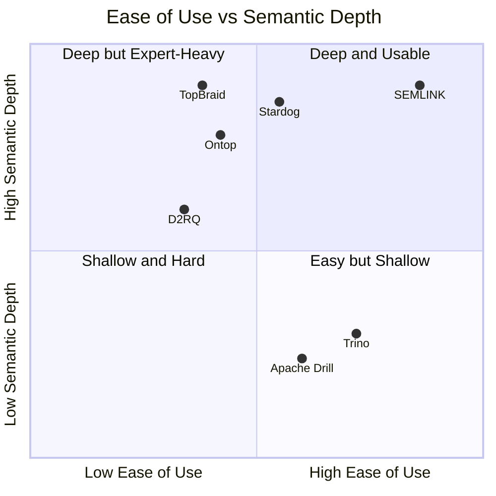

# SEMLINK Competitive Analysis

## Feature Matrix

| Product | Multi-DB Types | Semantic Layer | Auto-Mapping | NL Query | SHACL Quality | Open Source | Domain Ontology | Self-Service Onboarding | Java SDK |
| --- | --- | --- | --- | --- | --- | --- | --- | --- | --- |
| Ontop | Relational-first | High | Medium | No | No | Yes | Yes | Low | Yes |
| D2RQ | Relational/RDF | Medium | Low | No | No | Yes | Yes | Low | Java-based |
| Apache Drill | Files/NoSQL/SQL | Low | No | No | No | Yes | No | Medium | Java ecosystem |
| Trino | SQL connectors | Low | No | No | No | Yes | No | Medium | Java ecosystem |
| Stardog | DBs + knowledge graph | High | Medium | Some | Yes | No | Yes | Medium | Yes |
| TopBraid Composer | Ontology tooling | High | Low | No | Yes | No | Yes | Low | Limited |
| SEMLINK | SQL, document, graph, KV, wide-column, OWL, CSV | High | High | Yes | Yes | Yes | Yes | High | Yes |

## Unique Wedge

SEMLINK is the only open-source semantic integration framework in this comparison that combines automated R2O mapping, SHACL-based quality scoring, heterogeneous adapter support, natural-language-to-SPARQL querying, and a domain-specific central ontology in one course-demonstrable system. Unlike Ontop or D2RQ, it is designed for assisted onboarding by institutions that do not already employ ontology engineers.

## Positioning Matrix

