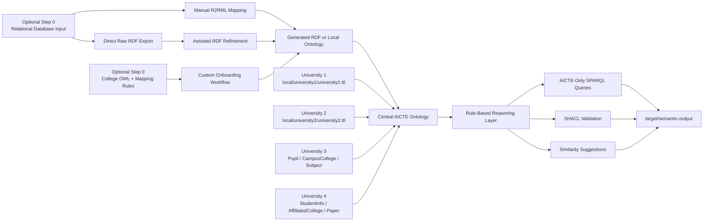

# Architecture

## Runtime Flow

0. Optionally convert a college relational database into RDF through the R2O layer.
   That layer now supports manual mapping, direct raw RDF export, and assisted refinement over the raw triples.
0A. Alternatively, accept a college-supplied OWL file plus mapping rules and run the same reasoning/query/validation pipeline on that package.
1. Load the four university ontologies plus the AICTE ontology.
2. Merge them into one RDF model without physically flattening the source files.
3. Apply controlled rules to materialize AICTE-aligned classes and properties.
4. Run named SPARQL queries using only the AICTE vocabulary.
5. Validate the inferred model with SHACL.
6. Export merged and inferred snapshots plus RDF/XML `.owl` copies for submission.

## Resource Layout

- `semantic/ontologies/central/` holds the AICTE ontology.
- `semantic/ontologies/local/` holds the four university ontologies plus preserved reference material for the reused repo sources.
- `semantic/ontologies/support/` holds validation-only helper data such as the invalid sample.
- `semantic/onboarding/` holds bring-your-own-OWL onboarding packages.
- `semantic/r2o/` holds the new relational-to-ontology onboarding example.
- `semantic/queries/core/`, `analysis/`, and `identity/` group the SPARQL files by purpose.
