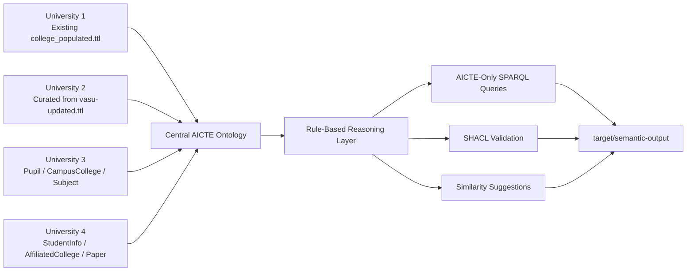

# Architecture

## Runtime Flow

1. Load the four university ontologies plus the AICTE ontology.
2. Merge them into one RDF model without physically flattening the source files.
3. Apply controlled rules to materialize AICTE-aligned classes and properties.
4. Run named SPARQL queries using only the AICTE vocabulary.
5. Validate the inferred model with SHACL.
6. Export merged and inferred snapshots plus RDF/XML `.owl` copies for submission.
