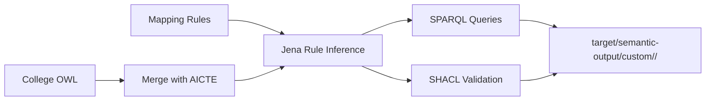

# Custom OWL Onboarding

## Purpose

This module supports colleges that already have their own OWL model and do not need the relational R2O path.

Instead of starting from SQL tables, the college provides:

- a local OWL file with classes, properties, and instance data
- a Jena rules file that maps local terms into the AICTE vocabulary

The application then runs the normal SEMLINK integration flow on top of that package.

## Input Files

### 1. College OWL

This file contains the college's local semantic model and data.

Typical contents:

- local classes such as `LearnerRecord`, `InstituteRecord`, or `ModuleRecord`
- local properties such as `fullName`, `enrolledAt`, or `managedBy`
- individuals representing students, colleges, courses, departments, and universities

Sample file:

- [college.owl](/home/ap/Downloads/SEMLINK/src/main/resources/semantic/onboarding/custom-sample/college.owl)

### 2. Mapping Rules

This file contains Jena forward rules that project the local OWL terms into AICTE terms.

Typical rule patterns:

- local class to `aicte:Student`, `aicte:College`, `aicte:Course`, or `aicte:University`
- local datatype property to `aicte:id` or `aicte:name`
- local object property to `aicte:studiesAt`, `aicte:belongsToUniversity`, or `aicte:offersCourse`
- derived rules, such as reading a local discipline resource and materializing `aicte:department`

Sample file:

- [mapping-rules.rules](/home/ap/Downloads/SEMLINK/src/main/resources/semantic/onboarding/custom-sample/mapping-rules.rules)

## Runtime Flow



## Command

```bash
JAVA_HOME=$(/usr/libexec/java_home -v 25) mvn -q exec:java -Dexec.args="custom run college-pack src/main/resources/semantic/onboarding/custom-sample/college.owl src/main/resources/semantic/onboarding/custom-sample/mapping-rules.rules"
```

Argument meaning:

- `college-pack`: output folder name under `target/semantic-output/custom/`
- first path: OWL input file
- second path: Jena mapping-rules file

## Output Package

Each run produces a self-contained folder under `target/semantic-output/custom/<package-name>/`.

Generated files:

- `college-input.ttl`: normalized Turtle export of the supplied OWL
- `mapping-rules.rules`: copied rule file used for the run
- `merged.ttl`: AICTE plus local college graph before inference
- `inferred.ttl`: materialized graph after base rules plus custom rules
- `query-results/`: results for the standard AICTE query set
- `validation/report.ttl`: SHACL validation report
- `summary.txt`: run summary with input paths and validation result

## Why This Module Matters

- It supports colleges that already have ontology assets.
- It separates local modeling from cross-institution integration.
- It keeps the same AICTE query and validation layer regardless of onboarding path.
- It makes the mapping step explicit and reviewable through a standalone rules file.

## Demo Guidance

For a course demo, show the module in this order:

1. Open the sample [college.owl](/home/ap/Downloads/SEMLINK/src/main/resources/semantic/onboarding/custom-sample/college.owl)
2. Open the sample [mapping-rules.rules](/home/ap/Downloads/SEMLINK/src/main/resources/semantic/onboarding/custom-sample/mapping-rules.rules)
3. Run the `custom run` command
4. Open `target/semantic-output/custom/college-pack/inferred.ttl`
5. Open `target/semantic-output/custom/college-pack/query-results/all_students.txt`
6. Open `target/semantic-output/custom/college-pack/validation/report.ttl`

The main point to explain is that the college controls both the local OWL and the mapping rules, while SEMLINK provides the standard reasoning, query, and validation runtime.
