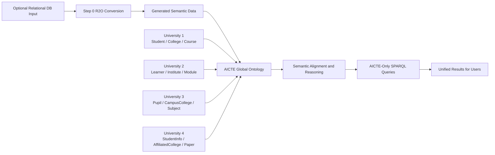
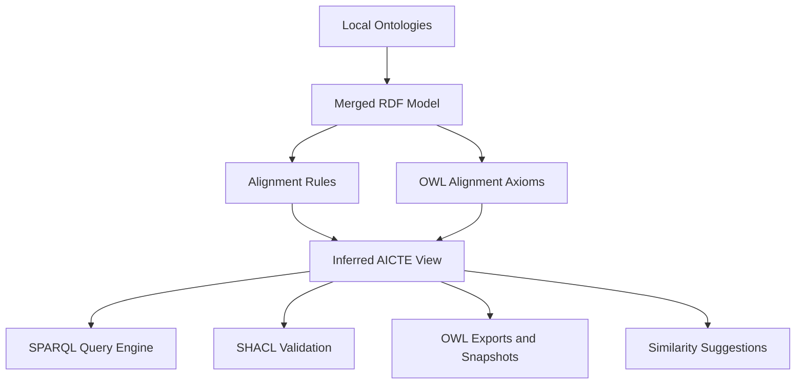
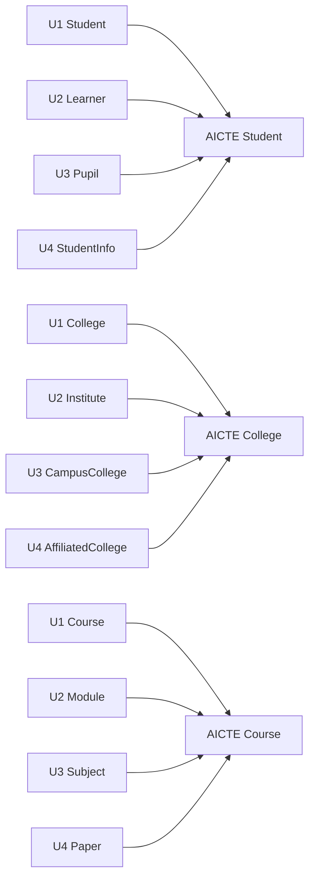
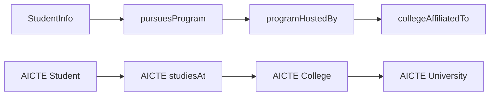
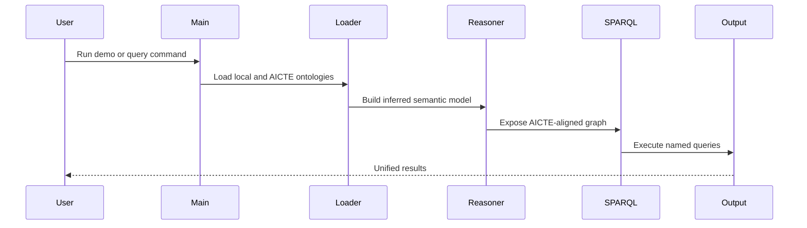
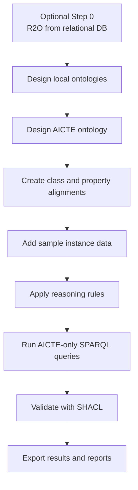

# Semantic Integration Deep Dive

## 1. Real-World Problem

In real life, universities rarely store data in the same format.

- One university may call a student `Student`.
- Another may call the same concept `Learner`.
- Another may use `Pupil` or `StudentInfo`.
- One system may connect students directly to colleges.
- Another may only connect students to programs, and programs to colleges.

If we try to integrate these systems using only SQL, we can join tables only when names and structures already match. That fails when the mismatch is semantic, not just structural.

This project solves that problem by using a central AICTE ontology as the semantic standard. Local university ontologies stay independent, but they are aligned to AICTE so that one SPARQL query can retrieve data from all of them.

## 2. Big Picture Diagram

### What this means

- A new college can start from its relational database through the R2O onboarding path.
- The four universities keep their own models.
- AICTE acts as the common meaning layer.
- Reasoning converts heterogeneous local facts into a unified semantic view.
- Users query only the AICTE vocabulary, not the local schemas.

## 3. Project Architecture Diagram

### Why this architecture was used

- We did not physically merge databases because the problem statement requires semantic integration without flattening the source systems.
- RDF was used because it gives one graph model that can represent all universities consistently.
- OWL was used because class and property equivalence are semantic relations, not simple column renames.
- A central ontology was used because one authority must define the shared meaning of `Student`, `College`, `University`, and `Course`.
- Rule-based reasoning was used in runtime because it gives controlled inference for the demo while still keeping OWL mappings in the ontology layer.

## 4. Ontology Mapping Diagram

### Why these mappings matter

- They show that the same real-world meaning can appear under different local names.
- `owl:equivalentClass` is the correct construct for saying that `Learner`, `Pupil`, and `StudentInfo` all represent the concept `Student`.
- `owl:equivalentProperty` is the correct construct for saying that different local predicates carry the same meaning as AICTE predicates.

### Why we did not simply rename local classes

- Renaming would destroy the evidence of heterogeneity.
- The project is about integration, not normalization by overwriting local meaning.
- Keeping local names is academically stronger because it proves the integration layer is doing real semantic work.

## 5. Structural Inference Diagram

University 4 was designed to demonstrate a structural conflict.

### What happens here

- In University 4, a student is not linked directly to a college.
- The student points to a program.
- The program points to a college.
- The college points to a university.

### Why this is important

- Real systems often differ not only in terminology but also in structure.
- A normal SQL union cannot solve this cleanly.
- Reasoning makes the hidden relationship explicit so the central AICTE query still works.

## 6. Query Execution Flow

### Why SPARQL was used

- SPARQL is the native query language for RDF graphs.
- It queries meaning-based triples, not table layouts.
- It lets us ask one question over semantically integrated data.

## 7. Why Each Technology Was Used

## RDF

### Why

- RDF gives a graph structure that is flexible enough for heterogeneous data.
- It avoids forcing all universities into one rigid relational schema.

### How it was used

- Each ontology is stored as RDF triples in Turtle.
- Instances such as students, colleges, departments, and courses are represented as nodes and relationships.

## OWL

### Why

- OWL adds semantic meaning on top of RDF.
- We need more than storage; we need semantic equivalence and inference.

### How it was used

- `owl:equivalentClass` for matching local classes to AICTE classes.
- `owl:equivalentProperty` for matching local predicates to AICTE predicates.
- `owl:sameAs` for identity links across ontologies.

## AICTE Ontology

### Why

- Without a central standard, each local ontology remains isolated.
- The AICTE ontology is the shared contract that all universities map into.

### How it was used

- It defines `Student`, `College`, `University`, `Course`, `Department`, `Program`, and the common properties.
- All central SPARQL queries are written against this ontology.

## Rule-Based Reasoning

### Why

- Some relationships are not explicit in the local data.
- Some local structures need controlled inference, especially for student-to-college resolution.

### How it was used

- Rules materialize `aicte:studiesAt`, `aicte:department`, `aicte:offersCourse`, and AICTE class memberships from local facts.
- This keeps runtime reasoning accurate and stable for the demo.

## SHACL

### Why

- Integration alone is not enough; we also need to know whether the final integrated data is valid.

### How it was used

- We validate that AICTE students have an ID, name, and department.
- We validate that colleges belong to universities.
- We also intentionally validate an invalid sample to show that constraint checking catches bad data.

## Similarity Matching

### Why

- In real projects, mappings are often discovered gradually.
- Manual mapping alone is slow.

### How it was used

- A similarity helper produces suggestions such as `Learner -> Student`, `Module -> Course`, and `registeredAt -> studiesAt`.
- It is a support tool, not the final source of truth.

## 8. End-to-End Project Flow

### Full explanation

1. We can now start either from a local ontology or from a relational database through the R2O step.
2. We build or reuse a standard AICTE ontology.
3. We connect each local ontology to the AICTE ontology semantically.
4. We populate or generate semantic data for students, colleges, courses, departments, and universities.
5. We reason over the merged graph to produce a unified AICTE view.
6. We query only the AICTE vocabulary.
7. We validate the integrated result.
8. We export the final artifacts for report and demo use.

## 9. Real-Life Use Cases

## National Regulatory Reporting

- A regulator like AICTE can receive heterogeneous university data without demanding one physical schema from everyone.
- It can still ask one standard question such as: "How many students are enrolled in Computer Science across all affiliated institutions?"

## Accreditation and Audit

- Auditors can check whether each college is linked to a university and whether student records are semantically complete.
- SHACL can act as a machine-checkable compliance layer.

## Scholarship and Welfare Portals

- If a student appears across systems with different identifiers, `owl:sameAs` can help the central system detect cross-record identity.
- This reduces duplicate benefits or missed entitlements.

## Student Mobility and Credit Transfer

- When a student moves from one institution to another, semantic mappings help identify equivalent concepts even if source systems use different terms.

## National Analytics

- The government or a central agency can compute cross-university statistics without forcing every institution to redesign its database.

## 10. Why This Project Is Useful Academically

- It demonstrates semantic heterogeneity, not just schema matching.
- It shows the difference between data integration and semantic integration.
- It uses core Semantic Web technologies together in one coherent pipeline.
- It gives both a theoretical and practical demo: ontologies, reasoning, querying, validation, and exported results.

## 11. One-Line Summary

This project shows how four different university systems can remain locally independent but become centrally queryable through a shared AICTE ontology, OWL-based alignment, controlled reasoning, and SPARQL.
