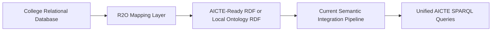
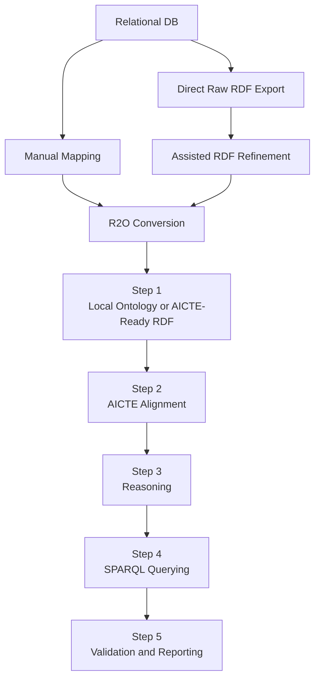

# R2O Extension

## Why Add an R2O Step

The current project assumes that a university or college already has an ontology.

In real life, that is often unrealistic.

- Colleges already maintain relational databases.
- They are comfortable entering rows in tables, not authoring OWL files.
- Asking every college to manually build ontologies creates adoption friction.

So the practical solution is to add a new Step 0:

**Relational Database to Ontology (R2O)**

This means a college can continue using its relational system, and an R2O layer converts that data into RDF before the rest of the semantic integration pipeline starts.

## New Step 0 Diagram



## How It Fits Into The Current Project



## Three Supported R2O Modes

### 1. Manual Mode

This is the fully controlled academic mode.

- A domain expert writes or edits the R2RML mapping manually.
- The mapping is reviewed directly by a human.
- RDF is generated from the approved mapping.

Command:

```bash
JAVA_HOME=$(/usr/libexec/java_home -v 25) mvn -q exec:java -Dexec.args="r2o generate example-college manual"
```

### 2. Raw RDF Export Mode

This is the direct standards-style projection step.

- The system reads the relational schema and rows.
- It emits raw RDF triples for tables, columns, and foreign-key links.
- It preserves source semantics before any AICTE-specific interpretation is applied.

Command:

```bash
JAVA_HOME=$(/usr/libexec/java_home -v 25) mvn -q exec:java -Dexec.args="r2o raw example-college"
```

Generated files:

- `target/semantic-output/r2o/example-college/raw/raw-direct-mapping.ttl`
- `target/semantic-output/r2o/example-college/raw/summary.txt`

### 3. Assisted Refinement Mode

This is the practical production mode.

- Raw RDF is generated first.
- The assistant reads those raw triples and promotes obvious facts into an AICTE-ready RDF layer.
- A human reviews the promoted output and the review report.

Command:

```bash
JAVA_HOME=$(/usr/libexec/java_home -v 25) mvn -q exec:java -Dexec.args="r2o assist example-college"
```

### 4. End-to-End Assisted Pipeline

This runs the raw RDF export and then the refinement pass immediately.

Command:

```bash
JAVA_HOME=$(/usr/libexec/java_home -v 25) mvn -q exec:java -Dexec.args="r2o pipeline example-college"
```

## Why This Is Better For Real Deployment

- Existing college software does not need to be replaced.
- Adoption becomes easier because colleges keep using familiar database screens.
- Semantic integration becomes an onboarding layer, not a manual modeling burden.
- New institutions can join the system faster.
- Automation reduces the first-pass semantic interpretation effort.
- Human review remains in the loop so semantic quality is not delegated blindly to heuristics.

## Example Added To This Project

The project now includes a worked R2O example at:

- `src/main/resources/semantic/r2o/example-college/schema.sql`
- `src/main/resources/semantic/r2o/example-college/sample-data.sql`
- `src/main/resources/semantic/r2o/example-college/r2rml-mapping.ttl`
- `src/main/resources/semantic/r2o/example-college/generated-aicte-ready.ttl`

### What the example shows

- A small relational schema for university, college, student, and course tables
- Sample SQL inserts
- A standards-style R2RML mapping file
- The semantic RDF output that would be produced
- A direct raw-RDF export that preserves table and foreign-key structure
- A local assistant that refines the raw triples into a compact AICTE-ready view
- A review report that highlights omitted columns and uncertain decisions

## Why R2RML Was Chosen For The Example

- It is a W3C standard for relational-to-RDF mapping.
- It is academically strong and easy to justify in reports.
- It shows a realistic implementation path beyond a purely conceptual R2O note.

## What Colleges Would Actually Do

1. Keep entering data in their existing relational database.
2. Run the raw export step to produce source-faithful RDF triples.
3. Let the assistant refine the raw graph into an AICTE-ready view.
4. Let a data steward review the promoted triples and any warnings.
5. Run the R2O renderer on schedule or on demand where manual mappings are preferred.
6. Feed the result into the same semantic integration pipeline used in the current project.

## Important Design Decision

This R2O extension does **not** replace the current ontology-based version.

Instead, the project now supports two entry modes:

- **Mode A:** ontology-first onboarding, which is the existing demo
- **Mode B:** R2O-assisted onboarding, which now includes manual mapping, raw RDF export, and assisted refinement over the raw graph
