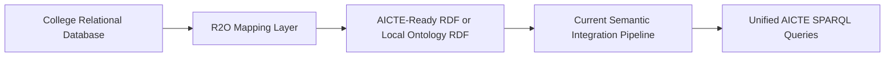
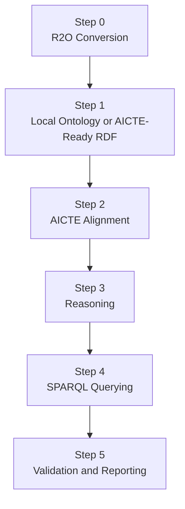

# R2O Extension

## Why Add an R2O Step

The current project assumes that a university or college already has an ontology.

In real life, that is often unrealistic.

- Colleges already maintain relational databases.
- They are comfortable entering rows in tables, not authoring OWL files.
- Asking every college to manually build ontologies creates adoption friction.

So the practical solution is to add a new Step 0:

**Relational Database to Ontology (R2O)**

This means a college can continue using its relational system, and an R2O mapping layer converts that data into RDF/OWL before the rest of the semantic integration pipeline starts.

## New Step 0 Diagram

## How It Fits Into The Current Project

## Why This Is Better For Real Deployment

- Existing college software does not need to be replaced.
- Adoption becomes easier because colleges keep using familiar database screens.
- Semantic integration becomes an onboarding layer, not a manual modeling burden.
- New institutions can join the system faster.

## Example Added To This Project

The project now includes a worked R2O example at:

- `src/main/resources/semantic/r2o/example-college/schema.sql`
- `src/main/resources/semantic/r2o/example-college/sample-data.sql`
- `src/main/resources/semantic/r2o/example-college/r2rml-mapping.ttl`
- `src/main/resources/semantic/r2o/example-college/generated-aicte-ready.ttl`

### What the example shows

- A small relational schema for university, college, student, and course tables
- Sample SQL inserts
- A standards-style R2RML mapping file
- The semantic RDF output that would be produced

## Why R2RML Was Chosen For The Example

- It is a W3C standard for relational-to-RDF mapping.
- It is academically strong and easy to justify in reports.
- It shows a realistic implementation path beyond a purely conceptual R2O note.

## What Colleges Would Actually Do

1. Keep entering data in their existing relational database.
2. Register the schema with a mapping template.
3. Run an R2O engine on schedule or on demand.
4. Produce RDF that is AICTE-ready or easily alignable.
5. Feed the result into the same semantic integration pipeline used in the current project.

## Important Design Decision

This R2O extension does **not** replace the current ontology-based version.

Instead, the project now supports two entry modes:

- **Mode A:** ontology-first onboarding, which is the existing demo
- **Mode B:** R2O-assisted onboarding, which is the new practical deployment extension
