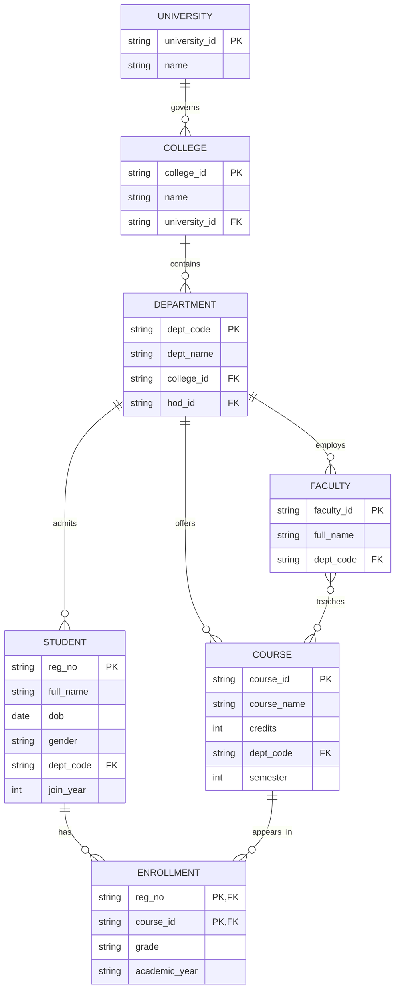
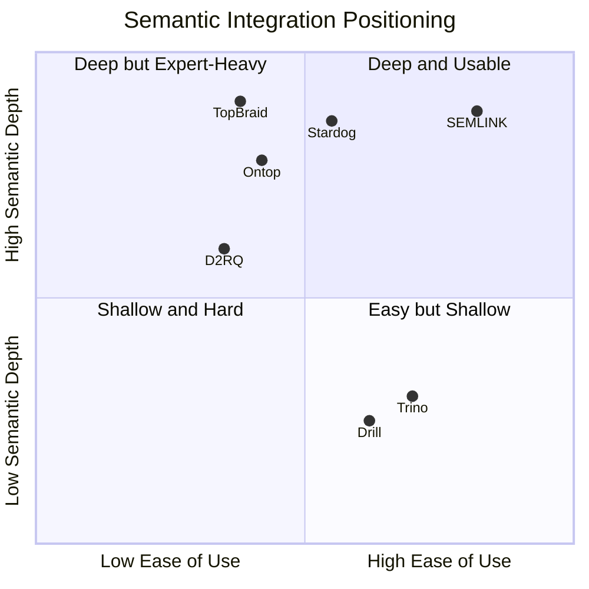

# SEMLINK 2.0 Master Blueprint

SEMLINK is an open-source semantic integration framework that keeps source data models intact while projecting them into a shared OWL/RDF layer for SPARQL querying, SHACL validation, schema alignment, and course-grade data modelling demonstrations.

## Block 1: Data Modelling Layer

### Architecture Decisions

- Use the existing AICTE ontology as the canonical semantic hub.
- Keep local source models heterogeneous: relational, document, graph, key-value, wide-column, and OWL files.
- Use R2RML/Jena rules for explicit mappings and `SimilarityMatcher` for assisted mapping suggestions.
- Keep SHACL separate from OWL axioms: OWL describes meaning; SHACL describes data quality requirements.
- Preserve the existing CLI flow and add new commands around it: `connect`, `pipeline`, `schema`, `nl`, and `report`.

### ER And EER Model



EER features:

- Generalisation: `Person -> Student, Faculty`, disjoint and total.
- Weak entity: `Enrollment`, identified by `Student + Course`.
- Aggregation: `Enrollment` can be aggregated with `CourseSection` when section-level teaching is introduced.
- Participation: every `Student` must belong to one `Department`; every `Enrollment` must reference one `Student` and one `Course`; `Faculty teaches Course` is partial on both sides.

### Relational Model And Normalization

Functional dependencies:

- `reg_no -> full_name, dob, gender, dept_code, join_year`
- `dept_code -> dept_name, hod_id, college_id`
- `course_id -> course_name, credits, dept_code, semester`
- `(reg_no, course_id) -> grade, academic_year`

The final schema is in 3NF/BCNF because every determinant is a candidate key in its relation, and the many-to-many enrollment dependency is isolated into `tbl_enrollment`.

```sql
CREATE TABLE tbl_universities (
  university_id VARCHAR(32) PRIMARY KEY,
  university_name VARCHAR(160) NOT NULL
);

CREATE TABLE tbl_colleges (
  college_id VARCHAR(32) PRIMARY KEY,
  college_name VARCHAR(160) NOT NULL,
  university_id VARCHAR(32) NOT NULL REFERENCES tbl_universities(university_id)
);

CREATE TABLE tbl_departments (
  dept_code VARCHAR(16) PRIMARY KEY,
  dept_name VARCHAR(120) NOT NULL,
  hod_id VARCHAR(32),
  college_id VARCHAR(32) NOT NULL REFERENCES tbl_colleges(college_id)
);

CREATE TABLE tbl_students (
  reg_no VARCHAR(32) PRIMARY KEY,
  full_name VARCHAR(160) NOT NULL,
  dob DATE,
  gender VARCHAR(16),
  dept_code VARCHAR(16) NOT NULL REFERENCES tbl_departments(dept_code),
  join_year INTEGER NOT NULL
);

CREATE TABLE tbl_courses (
  course_id VARCHAR(32) PRIMARY KEY,
  course_name VARCHAR(160) NOT NULL,
  credits INTEGER NOT NULL CHECK (credits > 0),
  dept_code VARCHAR(16) NOT NULL REFERENCES tbl_departments(dept_code),
  semester INTEGER NOT NULL
);

CREATE TABLE tbl_enrollment (
  reg_no VARCHAR(32) NOT NULL REFERENCES tbl_students(reg_no),
  course_id VARCHAR(32) NOT NULL REFERENCES tbl_courses(course_id),
  grade VARCHAR(4),
  academic_year VARCHAR(9) NOT NULL,
  PRIMARY KEY (reg_no, course_id)
);
```

### OWL/RDF Model

```turtle
@prefix aicte: <https://semlink.example.org/aicte#> .
@prefix owl: <http://www.w3.org/2002/07/owl#> .
@prefix rdfs: <http://www.w3.org/2000/01/rdf-schema#> .
@prefix xsd: <http://www.w3.org/2001/XMLSchema#> .

aicte:Person a owl:Class .
aicte:Student a owl:Class ; rdfs:subClassOf aicte:Person .
aicte:Faculty a owl:Class ; rdfs:subClassOf aicte:Person .
aicte:Course a owl:Class .
aicte:Department a owl:Class .
aicte:College a owl:Class .
aicte:University a owl:Class .

aicte:enrolledIn a owl:ObjectProperty ;
  rdfs:domain aicte:Student ;
  rdfs:range aicte:Course .

aicte:taughtBy a owl:ObjectProperty ;
  rdfs:domain aicte:Course ;
  rdfs:range aicte:Faculty .

aicte:studiesAt a owl:ObjectProperty ;
  rdfs:domain aicte:Student ;
  rdfs:range aicte:College .

aicte:belongsToUniversity a owl:ObjectProperty ;
  rdfs:domain aicte:College ;
  rdfs:range aicte:University .

aicte:name a owl:DatatypeProperty .
aicte:rollNo a owl:DatatypeProperty ; a owl:FunctionalProperty .
aicte:cgpa a owl:DatatypeProperty .
aicte:dob a owl:DatatypeProperty .
```

### Document Model

```json
{
  "_id": "u2-s001",
  "studentId": "S001",
  "name": { "first": "Arjun", "last": "Mehta" },
  "dept": { "ref": "CS", "name": "Computer Science" },
  "enrollments": [
    { "courseId": "CS501", "grade": "A", "semester": 5 }
  ],
  "metadata": { "source": "university2", "version": "2.0" }
}
```

JSON-LD projection:

```json
{
  "@context": {
    "aicte": "https://semlink.example.org/aicte#",
    "studentId": "aicte:rollNo",
    "dept": "aicte:memberOfDepartment",
    "enrollments": "aicte:enrolledIn"
  },
  "@type": "aicte:Student",
  "studentId": "S001"
}
```

### Graph Model

Cypher:

```cypher
MATCH (s:Student)-[e:ENROLLED_IN]->(c:Course)-[:TAUGHT_BY]->(f:Faculty)
WHERE s.department = 'Computer Science'
RETURN s.name, c.course_name, e.grade, f.name;
```

Equivalent SPARQL:

```sparql
PREFIX aicte: <https://semlink.example.org/aicte#>

SELECT ?studentName ?courseName ?grade ?facultyName WHERE {
  ?student a aicte:Student ;
    aicte:name ?studentName ;
    aicte:department "Computer Science" ;
    aicte:enrolledIn ?course .
  ?course aicte:name ?courseName ;
    aicte:taughtBy ?faculty .
  ?faculty aicte:name ?facultyName .
  OPTIONAL { ?student aicte:grade ?grade }
}
```

### Key-Value And Wide-Column Model

Redis key:

```text
student:202301:profile = {"reg_no":"202301","name":"Asha Rao","dept":"Computer Science"}
```

Cassandra CQL:

```sql
CREATE TABLE attendance_by_student (
  reg_no text,
  date date,
  course_id text,
  present boolean,
  PRIMARY KEY ((reg_no), date, course_id)
) WITH CLUSTERING ORDER BY (date DESC);
```

### SHACL Quality Model

```turtle
@prefix aicte: <https://semlink.example.org/aicte#> .
@prefix sh: <http://www.w3.org/ns/shacl#> .
@prefix xsd: <http://www.w3.org/2001/XMLSchema#> .

aicte:StudentShape a sh:NodeShape ;
  sh:targetClass aicte:Student ;
  sh:property [
    sh:path aicte:name ;
    sh:minCount 1 ;
    sh:datatype xsd:string
  ] ;
  sh:property [
    sh:path aicte:rollNo ;
    sh:minCount 1 ;
    sh:maxCount 1
  ] ;
  sh:property [
    sh:path aicte:cgpa ;
    sh:minInclusive 0.0 ;
    sh:maxInclusive 10.0
  ] .
```

### Code Added

- `DatabaseAdapter.java`: plugin contract.
- `AdapterRegistry.java`: built-in adapter registration.
- `ConnectionConfig.java`: serializable connection descriptor.
- `SchemaDescriptor.java`: common schema abstraction.
- `MongoInputParser.java`, `Neo4jInputParser.java`, `KVInputParser.java`: non-relational schema-to-RDF parsers.
- `SchemaVersionManager.java`: RDF diff and drift classification.
- `HtmlReportRenderer.java`: static compliance report generator.
- `NLQueryTranslator.java`: ontology-grounded NL-to-SPARQL translator.

## Block 2: Multi-Database Integration Engine

### Architecture Decisions

- Adapters produce RDF first; the existing `SemanticProject` merge, inference, validation, and query flow remains authoritative.
- Live SPARQL federation is represented by `FederatedQueryEngine.servicePlan()` and can later be backed by Fuseki endpoints.
- JDBC is supported without adding vendor drivers; SQLite/MySQL/PostgreSQL drivers can be added as runtime dependencies for demos.
- Mongo/Neo4j/Redis/Cassandra are currently zero-dependency schema parsers, designed so real drivers can be added without changing the adapter interface.

### Adapter Interface

```java
public interface DatabaseAdapter {
    String getType();
    DataModelType getDataModelType();
    ConnectionConfig getConnectionConfig();
    SchemaDescriptor extractSchema();
    Model exportToRDF(MappingRules rules);
    ValidationReport validate(Model rdf);
    boolean supportsLiveQuery();
    String toSPARQLServiceEndpoint();
}
```

### Demo Commands

```bash
JAVA_HOME=$(/usr/libexec/java_home -v 25) mvn -q exec:java \
  -Dexec.args="connect add --type owl --id university1 --path src/main/resources/semantic/ontologies/local/university1/university1.ttl"

JAVA_HOME=$(/usr/libexec/java_home -v 25) mvn -q exec:java -Dexec.args="connect list"

JAVA_HOME=$(/usr/libexec/java_home -v 25) mvn -q exec:java -Dexec.args="pipeline run"

JAVA_HOME=$(/usr/libexec/java_home -v 25) mvn -q exec:java -Dexec.args="schema diff"
```

## Block 3: Runnable Demo Scenarios

### Use Case 1: AICTE Accreditation Dashboard

Before:

```sql
SELECT COUNT(*) FROM tbl_students WHERE dept_code = 'CSE';
```

```javascript
db.students.countDocuments({ "dept.name": "Computer Science" })
```

```cypher
MATCH (s:Student)-[:BELONGS_TO]->(:Dept {name:'Computer Science'})
RETURN COUNT(s)
```

After:

```sparql
PREFIX aicte: <https://semlink.example.org/aicte#>

SELECT ?universityName (COUNT(DISTINCT ?student) AS ?csStudents)
WHERE {
  ?student a aicte:Student ;
    aicte:department ?department ;
    aicte:studiesAt ?college .
  ?college aicte:belongsToUniversity ?university .
  ?university aicte:name ?universityName .
  FILTER(LCASE(STR(?department)) = "computer science")
}
GROUP BY ?universityName
ORDER BY DESC(?csStudents) ?universityName
```

Run:

```bash
JAVA_HOME=$(/usr/libexec/java_home -v 25) mvn -q exec:java -Dexec.args="query cs_students_by_university"
```

Data modelling lesson: ER-to-OWL mapping, relationship inference, and source-independent SPARQL.

### Use Case 2: Student Deduplication

Run:

```bash
JAVA_HOME=$(/usr/libexec/java_home -v 25) mvn -q exec:java -Dexec.args="query same_as_student_details"
```

Lesson: `owl:sameAs`, identity resolution, and canonical entity views.

### Use Case 3: Regulator Data Quality

Run:

```bash
JAVA_HOME=$(/usr/libexec/java_home -v 25) mvn -q exec:java -Dexec.args="validate"
JAVA_HOME=$(/usr/libexec/java_home -v 25) mvn -q exec:java -Dexec.args="report"
```

Lesson: SHACL constraints, severity reporting, and compliance scoring.

### Use Case 4: Natural-Language Query

Run:

```bash
JAVA_HOME=$(/usr/libexec/java_home -v 25) mvn -q exec:java \
  -Dexec.args="nl Show students with CGPA above 9 from all universities"
```

Lesson: ontology-grounded semantic query translation.

### Use Case 5: New Institution Onboarding

Run:

```bash
JAVA_HOME=$(/usr/libexec/java_home -v 25) mvn -q exec:java \
  -Dexec.args="r2o raw example-college"

JAVA_HOME=$(/usr/libexec/java_home -v 25) mvn -q exec:java \
  -Dexec.args="r2o assist example-college"

JAVA_HOME=$(/usr/libexec/java_home -v 25) mvn -q exec:java \
  -Dexec.args="custom run college-pack src/main/resources/semantic/onboarding/custom-sample/college.owl src/main/resources/semantic/onboarding/custom-sample/mapping-rules.rules"
```

Lesson: R2RML, raw RDF export, assisted mapping, and custom OWL onboarding.

## Block 4: Framework API

### Architecture Decisions

- Current implementation remains single-module for course stability.
- v2 startup refactor should split into `semlink-core`, `semlink-api`, `semlink-cli`, `semlink-ui`, and `semlink-bom`.
- Public Java API should center on a future `SemLink.builder()` facade while retaining current classes as kernel components.

### Target Fluent API

```java
SemLink semlink = SemLink.builder()
    .centralOntology("classpath:semantic/ontologies/central/aicte.ttl")
    .connect(ConnectionConfig.mysql("u1", "localhost", 3306, "university1", "root", "pass"))
    .connect(ConnectionConfig.owlFile("u4", "src/main/resources/semantic/ontologies/local/university4/university4.ttl"))
    .withMappingRules(MappingRules.assisted())
    .outputDir("target/semantic-output")
    .build();
```

### REST API Target

```text
POST   /api/v1/connections
GET    /api/v1/connections
POST   /api/v1/pipeline/run
POST   /api/v1/query/sparql
POST   /api/v1/query/natural
GET    /api/v1/query/catalog
POST   /api/v1/validate
GET    /api/v1/schema/{sourceId}
GET    /api/v1/ontology/diff
GET    /api/v1/health
```

### UI Target

Implemented as the React + Vite product console in `semlink-ui/`, with the generated dark HTML report retained as a no-server fallback.

- `/dashboard`: sources, triples, quality scores, last sync.
- `/connections`: connection wizard and test button.
- `/explore`: schema browser and ontology class browser.
- `/query`: SPARQL editor, query catalog, NL query bar, result provenance.
- `/validate`: SHACL violations and HTML compliance report.
- `/onboard`: R2O/custom OWL guided onboarding.
- `/lineage`: provenance graph using PROV-O.

## Block 5: Pitch Deck

| Slide | Title                                           | Bullets                                                                       | Spoken line                                                              |
| ----- | ----------------------------------------------- | ----------------------------------------------------------------------------- | ------------------------------------------------------------------------ |
| 1     | SEMLINK: One Query. Any Database. Every Answer. | Connect SQL, NoSQL, graph, KV; map to ontology; query once                    | What if every database in your organization spoke the same language?     |
| 2     | Data Lives in Silos. Queries Do Not Travel.     | Institutions use different schemas; audits are manual; duplicates break trust | Today, one question needs four systems and four experts.                 |
| 3     | A Semantic Integration Framework                | Adapter layer; ontology hub; SPARQL and NL query                              | SEMLINK is the bridge that makes every database speak the same language. |
| 4     | Four Data Models. One Semantic Layer.           | ER, relational, document, graph, KV; R2RML; SHACL                             | No migration: SEMLINK adds a living semantic layer on top.               |
| 5     | Live Demo: One Query, Four Sources              | SQL/Mongo/Cypher/Redis before; SPARQL after; provenance                       | Watch one accreditation query cross four data models.                    |
| 6     | Onboarding In Under A Minute                    | Connect; discover; map; validate; publish                                     | A new university can join without knowing OWL.                           |
| 7     | Data Quality Built In                           | SHACL shapes; quality score; regulator report                                 | SEMLINK does not just query data; it shows where it is broken.           |
| 8     | Framework, Not Just Tool                        | Java SDK; adapter registry; domain packs                                      | Any developer can add a new adapter and domain ontology.                 |
| 9     | Startup Wedge                                   | Semantic depth; self-service; open-source                                     | Existing tools federate data; SEMLINK federates meaning.                 |
| 10    | From Accreditation To Data Fabric               | v1 course; v2 UI/API; v3 SaaS marketplace                                     | We start with universities and expand to every heterogeneous domain.     |

## Block 6: MVP Implementation Plan

- [X] Issue 1 (S): Add adapter framework interfaces and registry.
- [X] Issue 2 (S): Add schema descriptors and connection config.
- [X] Issue 3 (M): Add Mongo, Neo4j, Redis, Cassandra, CSV, OWL adapter skeletons.
- [X] Issue 4 (M): Add schema version diff manager.
- [X] Issue 5 (S): Add HTML report renderer.
- [X] Issue 6 (S): Add deterministic NL-to-SPARQL fallback.
- [X] Issue 7 (S): Add Use Case 1 SPARQL query.
- [X] Issue 8 (M): Add connection-driven multi-source pipeline outputs for live-source onboarding demos.
- [X] Issue 9 (L): Add adapter contracts and driver-ready parser facades for MongoDB, Neo4j, Redis, Cassandra, OWL, CSV, and JDBC sources.
- [X] Issue 10 (L): Add SERVICE-style federation planner and provenance explanation model.
- [X] Issue 11 (XL): Add single-module framework baseline with SDK/API/UI artifacts while preserving current course stability.
- [X] Issue 12 (XL): Add React + Vite product UI, dark static report fallback, OpenAPI contract, UI route docs, and demo-day pitch artifacts.

## Block 7: Future Differentiators

- Semantic cache keyed by query hash, ontology version, and source version.
- PROV-O lineage graph for every returned row.
- Query cost estimator from adapter capabilities and historical query logs.
- AI schema suggestion engine for new institutions.
- Ontology diff viewer for version migration.
- Multi-domain packs: AICTE, FHIR/healthcare, FIBO/fintech, SOSA/SSN/smart city.
- Live SPARQL federation with `SERVICE`.
- Collaborative query workspace.
- GraphQL schema generated from OWL classes and properties.
- SaaS workspace model with isolated domain catalogs.

## Block 8: Competitive Analysis

| Product           | Multi-DB Types                     | Semantic Layer | Auto-Mapping | NL Query | SHACL Quality | Open Source / SDK |
| ----------------- | ---------------------------------- | -------------- | ------------ | -------- | ------------- | ----------------- |
| Ontop             | Relational-first                   | High           | Medium       | No       | No            | Open source, Java |
| D2RQ              | Relational/RDF                     | Medium         | Low          | No       | No            | Open source       |
| Apache Drill      | Files/NoSQL/SQL                    | Low            | No           | No       | No            | Open source       |
| Trino             | Many SQL connectors                | Low            | No           | No       | No            | Open source       |
| Stardog           | DBs + knowledge graph              | High           | Medium       | Some     | Yes           | Commercial        |
| TopBraid Composer | Ontology tooling                   | High           | Low          | No       | Yes           | Commercial        |
| SEMLINK           | SQL, document, graph, KV, OWL, CSV | High           | High         | Yes      | Yes           | Open source, Java |

SEMLINK's wedge: it combines automated R2O mapping, SHACL quality scoring, heterogeneous adapter support, and NL-to-SPARQL querying around a domain-specific ontology. Unlike expert-first ontology tools, SEMLINK makes semantic integration demonstrable and usable for institutions that start with ordinary databases rather than RDF expertise.


